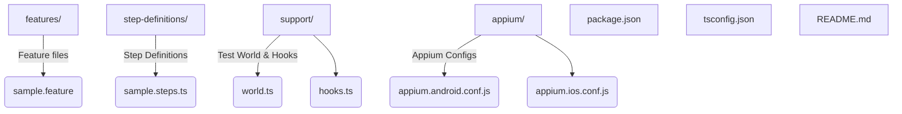

# Playwright-Appium-Cucumber Mobile Test Automation

## Overview

This project provides a cross-platform mobile test automation framework using **Playwright**, **Cucumber (Gherkin)**, **TypeScript**, and **Appium**. It supports both iOS and Android app testing, with feature files for BDD, and generates HTML reports. The framework can also trigger the iOS simulator for local test runs.

---

## Project Structure



---

## Frameworks & Tools

- **Playwright**: Modern browser and mobile automation library.
- **Appium**: Mobile automation server for iOS and Android.
- **Cucumber**: BDD framework using Gherkin feature files.
- **TypeScript**: Strongly-typed language for scalable test code.
- **cucumber-html-reporter**: Generates HTML reports from Cucumber JSON output.

---

## Setup Instructions

1. **Install Dependencies**

   ```sh
   npm install
   ```

2. **Configure App Paths**

   - Update `appium/appium.android.conf.js` and `appium/appium.ios.conf.js` with the correct paths to your `.apk` and `.app` files.

3. **Start Appium Server**

   ```sh
   npx appium
   ```

4. **Boot iOS Simulator (if testing iOS)**
   ```sh
   npm run ios:simulator
   ```

---

## Running Tests

- **iOS Tests:**
  ```sh
  npm run test:ios
  ```
- **Android Tests:**
  ```sh
  npm run test:android
  ```

---

## Generating HTML Reports

After running tests, generate a report:

```sh
npm run report
```

This will create `cucumber_report.html` in the project root.

---

## Customizing Tests

- **Feature files:** Add scenarios in `features/*.feature`.
- **Step definitions:** Implement steps in `step-definitions/*.ts`.
- **Selectors:** Update selectors in step definitions to match your app's UI.

---

## Environment Variables

- `PLATFORM`: Set to `ios` or `android` to control which platform to test. Defaults to `ios` in scripts.

---

## Troubleshooting

- Ensure Appium server is running before executing tests.
- Make sure the simulator/emulator is booted and matches the device name in the config.
- Update app paths and device names as needed in the Appium config files.

---

## Useful Commands

- `npm run ios:simulator` — Boot iOS simulator
- `npm run test:ios` — Run iOS tests
- `npm run test:android` — Run Android tests
- `npm run report` — Generate HTML report

---

## License

MIT
# Playwright-appium-cucumber-Test-framework
